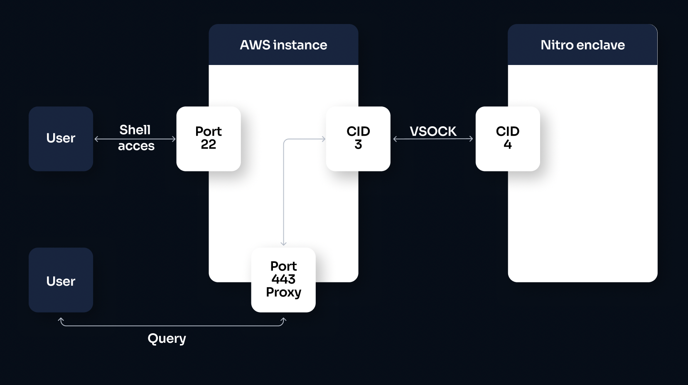

# Under the hood

> ⚠️ This guide is a direct follow up of the [Quick tour](https://blindbox.mithrilsecurity.io/en/latest/docs/getting-started/quick-tour/). If you haven't read it, you should do that first [⏭️](https://blindbox.mithrilsecurity.io/en/latest/docs/getting-started/quick-tour/) 

In the Quick tour, we saw how we can use the built-in API to query the Whisper model, while protecting data during computation with a Nitro enclave environment.

Let's take a look at what is going on under the hood when we use the Whisper API, because this will all be informative as to BlindBox's future workflow.

## Nitro Enclave server
__________________

When you use our default BlindBox Whisper API, you connect to the **BlindBox Nitro server hosted by Mithril Security**. 

Nitro Enclaves are an **AWS technology** and can be deployed on **Amazon EC2 instances only** (ours is on an [Amazon EC2 R6i Instance](https://aws.amazon.com/ec2/instance-types/r6i/)).

The advantage of this is that it allows **you to test** our APIs **for free** and **without spending any time on deployment**. 

> But if you want to deploy your own BlindBox API server for Nitro enclaves, we made a guide explaining how to do it [here](./deploy-API-server.md).

### Configuration

Let's take a look at how our Nitro server is configured:



+ Queries are sent to our AWS instance on **port 443** as **HTTP requests**.
+ They are then redirected to our enclave via the **VSOCK** channel.
+ The **enclave** handles the requests.
+ The results are returned via the **VSOCK** channel.

## Attestation
________________________

The attestation process is where we verifies the enclave application's code, settings and OS, before allowing any communication between the client and the enclave. 

> For more details about attestation, check out the attestation section in our [how we protect your data guide](../getting-started/confidential_computing.md).

With BlindBox, the attestation process takes place as soon as a client tries to connect to a service running in a enclave with BlindBox.

In the [Quick tour](https://blindbox.mithrilsecurity.io/en/latest/docs/getting-started/quick-tour/), we saw how we can use our demo LLM API to query the OpenChatKit and the Whisper models using the `Completion.create()` or `Audio.transcribe()` methods respectively.

Under the hood, the first thing these methods do is connect to our Mithril API server, as we can see here:

```python
#  connect to your server instance
BLINDAI_NITRO_SERVER = "44.228.153.183"

# connect to our Mithril BlindBox API server
client = blindbox.ai.connection.connect(
    addr=BLINDAI_NITRO_SERVER,
)
```

This method returns a `BlindBox Connection` object to us which allows us to keep track of this connection for following queries.

If we were to attempt to connect with an enclave running a modified version of the BlindBox API or a misconfigured enclave, we would see the following error:


## Querying our LLM models
____________________________

Assuming the attestation process is successful and a connection is established, the `Audio.transcribe()` or `Completion.create()` methods proceed to query the relevant LLM model by **sending a request** to our **verified Nitro enclave** using a **secure TLS communication channel**.

```python
import requests

res = requests.post(
    "https://nitro.mithrilsecurity.io/whisper/predict",
    files={
        "audio": open("taunt.wav", "rb"),
    },
).text # `.text` attribute used to specify we want results in string format
```

The **computation** performed to get the result is **performed within the Nitro enclave** and the data sent to the enclave is **never accessible to anyone outside** of the enclave.

The **results** of the query are recovered by the user and are not accessible to anyone else during this process.

## Conclusions
_________________

In this guide, we have:

+ Seen how the Mithril **Nitro server is set-up**. 
+ Discussed how **attestation protects** your data. 
+ Discovered how **queries are performed** under the hood. 